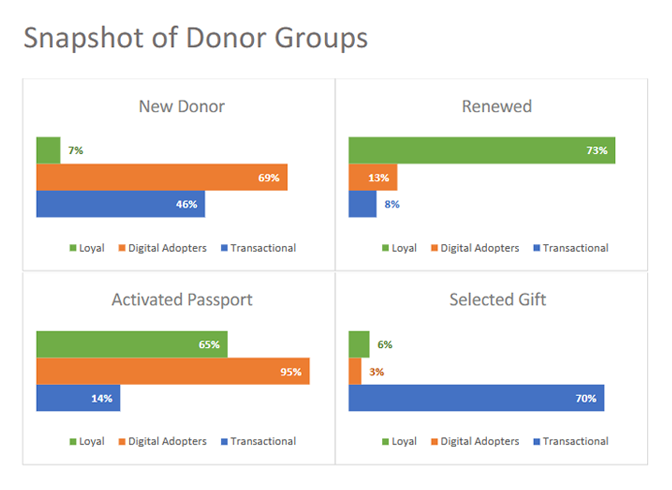
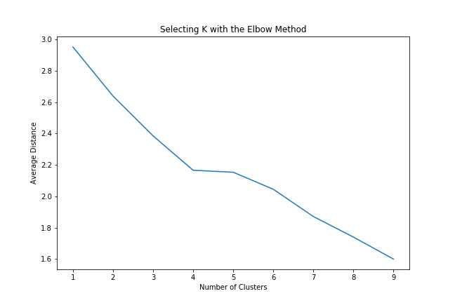
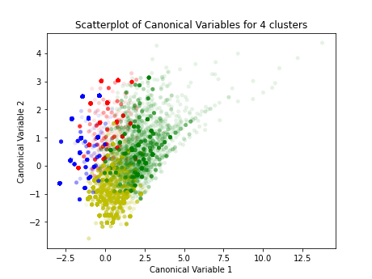

# KLRN Donor Analytics Suite

A comprehensive suite of Python tools to analyze KLRN TV donors. Features include:

- **Cluster Analysis:** Identifies and groups donors based on shared characteristics and behaviors

- **Segment Creation:** Develops segments for detailed comparisons and insights based on donor behaviors

- **Data Augmentation:** Enhances analyses with additional layers of demographics and PBS Passport viewing data

- **Timeline Creation:** Generates timelines, including segmented timelines, with options to use time intervals of annual, monthly or weekly.

This suite provides a framework to understand KLRN donors through comprehensive analysis and data integration.

### Data Setup

Cluster and segment analyses use data downloaded into an .xlsx file from an Allegiance Fundraising database. The Excel file is placed in the `data/raw/` directory.KLRN Analytic Reports

The database query is constructed with Allegiance's [Analysis Reports](https://alleg.tv/userguides172/FR-AnalysisReports/AnalysisReports.html), using the Pledge type. This is the [specific query](images/2022-09-26-donors-query.jpg).

Using a list of donor ids from the Allegiance download, demographics are pulled into a separate .xlsx file from WealthEngine. This Excel file needs to have `AcctID`, `Gender`, `Age`, and `Income` columns. The file is placed in the `data/raw/` directory.

PBS Passport video views are layered over data using [KLRN's Passport Analytics Database](https://github.com/ptdriscoll/klrn-passport-analytics-database), a desktop application.

Tests can be set up by running a small dataset from an Allegiance download that covers all variables, and in turn using the ids from that data pull to get demographics and Passport views, and then inspecting results to make sure they are what was expected. NOTE: code for cluster tests always produce four clusters.

Verified spreadsheets for expected outcomes are placed in `tests/data_expected/` and `tests/output_expected/`, in parallel with spreadsheets saved by code to `data/` and `output/` (NOTE: code for cluster tests expect four clusters):

- `tests/data_expected/processed/`
- `tests/output_expected/cluster/`
- `tests/output_expected/new_donors/`
- `tests/output_expected/passport_gifts/`
- `tests/output_expected/passport_only/`
- `tests/output_expected/timeline/`

### Config Setup

Configuration is set up under `src/config.py`:

- All date formats are `'2022-09-30'`
- `DATA_DONORS` = `<name of raw xlsx file from Allegiance database download>`
- `DATA_DEMOGRAPHICS` = `<name of xlsx file with demographics from WealthEngine download>`
- `DATA_START` = `<start of date range to filter data>`
- `DATA_END` = `<end of date range to filter data, which is inclusive>`
- `YEAR_CUTOFF` = `<pandas shorthand code for a time interval>` - i.e., the fiscal year is `Y-SEP` - [reference](https://pandas.pydata.org/pandas-docs/stable/user_guide/timeseries.html)
- `PASSPORT_APP` = `<path to directory where Passport database app is located on computer system>`
- `PASSPORT_VIEWS_START_DATE` = `<start of date range to filter Passport views>`
- `PASSPORT_VIEWS_END_DATE` = `<end of date range to filter Passport views, which is inclusive>`

Dates for tests are set up at the end of `src/__init__.py`, under the comment `CUSTOM DATES FOR TESTS`:

- All date formats are `'2022-09-30'`
- `DATA_START` = `<start of date range to filter data>`
- `DATA_END` = `<end of date range to filter data, which is inclusive>`
- `YEAR_CUTOFF` = `<pandas shorthand code for a time interval>` - i.e., the fiscal year is `Y-SEP` - [reference](https://pandas.pydata.org/pandas-docs/stable/user_guide/timeseries.html)
- `PASSPORT_VIEWS_START` = `<start of date range to filter Passport views>`
- `PASSPORT_VIEWS_END` = `<end of date range to filter Passport views, which is inclusive>`

### Code Setup

This application uses a Conda environment to manage dependencies. If you don't have Conda installed, you get it at [Anaconda](https://www.anaconda.com/download/) or [Miniconda](https://docs.anaconda.com/miniconda/).

The environment is defined in `environment.yml`. The `name` is set to `klrn-donor-analysis`, which can be changed.

In an Anaconda Prompt, from the application's root directory, there are two options to set up the environment:

- Option 1, system-wide environment:

  - **Create Environment:** `conda env create -f environment.yml`
  - **Activate Environment:** `conda activate <name>`
  - **Update Environment:** `conda env update -f environment.yml`

- Option 2, working-directory environment:

  - **Create Environment:** `conda env create -p venv -f environment.yml`
  - **Activate Environment:** `conda activate ./venv`
  - **Update Environment:** `conda env update -p ./venv -f environment.yml`

### Running Commands

Processes data, and outputs to `data/processed/`:

- `python -m src.process.donors`
- `python -m src.process.new_donors`
- `python -m src.process.demographics`

Runs cluster analysis, first clearing `output/cluster/` and then outputting there (if needed, runs `src.process.donors`):

- `python -m src.cluster.elbow_plot <number>`
  - Evaluates optimal number of clusters by generating an elbow plot that visualizes where adding more clusters no longer significantly reduces tightness within clusters.
  - The `<number>` parameter is optional; if omitted, it defaults to `9`, plotting a range from 1 to 9 clusters.
- `python -m src.cluster.pca_plots <number> <number>`
  - Evaluates optimal number of clusters by creating PCA model scatterplots that show a range of clusters.
  - The `<number> <number>` parameters are both optional; you can provide both, one or none. If omitted, the second argument defaults to one higher than the first, and the first defaults to `3`. So, no arguments would default to `3 4` and generate one plot of three clusters.
- `python -m src.cluster.kmeans <number>`
  - Runs cluster analysis, generates cluster assignments as `assignments.csv`, assignment aggregations as `groups.csv`, and PCA model and group frequencies plots.
  - The `<number>` parameter is optional; if omitted, it defaults to `4`, creating four cluster groups.

  
  

Creates donor segments, first clearing the respective folder in `output/<segment>/` and then outputting `assignments.csv` there (if needed, also runs either `src.process.donors` or `src.process.new_donors`):

- `python -m src.segment.new_donors`
- `python -m src.segment.passport_gifts`
- `python -m src.segment.passport_only`

Demographics per group can be added after cluster or segment commands have run, with `demographics.csv` outputted to respective folder in `output/<segment>/`:

- `python -m src.augment.demographics cluster`
- `python -m src.augment.demographics new_donors`
- `python -m src.augment.demographics passport_gifts`
- `python -m src.augment.demographics passport_only`

Passport PBS video views per group can be added after cluster or segment commands have run, and if the [Passport database app](https://github.com/ptdriscoll/klrn-passport-analytics-database) is available, with `demographics_<group>.csv` files outputted to respective folder in `output/<segment>/`:

- `python -m src.augment.passport cluster`
- `python -m src.augment.passport new_donors`
- `python -m src.augment.passport passport_gifts`
- `python -m src.augment.passport passport_only`

Creates timelines, first clearing `output/timeline/` and then outputting there (if needed, runs `src.process.donors`) - the `time_interval` argument can be `annual`, `monthly`, `weekly` or left empty (if left empty, it defaults to `annual`):

- `python -m src.timeline.all <time_interval>`
- `python -m src.timeline.new_other <time_interval>`
- `python -m src.timeline.passport_gifts <time_interval>`

### Running Tests

Tests processing data:

- `python -m tests.src.process.donors`
- `python -m tests.src.process.new_donors`
- `python -m tests.src.process.demographics`

Tests cluster analysis:

- `python -m tests.src.cluster.kmeans`
  - code produces four clusters
  - also runs `src.cluster.pca_plots`

Tests segment creation:

- `python -m tests.src.segment.new_donors`
- `python -m tests.src.segment.passport_gifts`
- `python -m tests.src.segment.passport_only`

Tests adding demographics, after respective cluster or segment tests have run

- `python -m tests.src.augment.demographics cluster`
- `python -m tests.src.augment.demographics new_donors`
- `python -m tests.src.augment.demographics passport_gifts`
- `python -m tests.src.augment.demographics passport_only`

Tests adding Passport views, after respective cluster or segment commands have run, and if the [Passport database app](https://github.com/ptdriscoll/klrn-passport-analytics-database) is available:

- `python -m tests.src.augment.passport cluster`
- `python -m tests.src.augment.passport new_donors`
- `python -m tests.src.augment.passport passport_gifts`
- `python -m tests.src.augment.passport passport_only`

Tests timeline creation - the `time_interval` argument can be `annual`, `monthly`, `weekly` or left empty (if left empty, it defaults to `annual`):

- `python -m tests.src.timeline.all <time_interval>`
- `python -m tests.src.timeline.new_other <time_interval>`
- `python -m tests.src.timeline.passport_gifts <time_interval>`

### Data considerations

- A donation is flagged as Passport if Passport was activated within the 1-year pledge window
- A donation is flagged as having a Gift Premium if the member requested a gift
- A donation is flagged as new if the member has never donated before
- A donation can also be flagged as sustaining, rejoin, renew, add or online
- Also looked at, per donor, were total donations, total payments, current member status, and
  major donor status

### KLRN Analytic Reports

- [Donor Profiles 2024](reports/KLRN_Donor_Profiles_2024.pdf)
- [Donor Cluster Models 2024](reports/KLRN-Cluster-Models-2024.pdf)
- [Passport Engagement 2024 (external data)](reports/KLRN_Passport_Engagement_2024.pdf)
- [Donor Profiles 2022](reports/KLRN_Donor_Profiles_2022.pdf)
- [Passport Audience 2022](reports/KLRN_Passport_Audience_2022.pdf)

### References

- [Allegiance Fundraising: Analysis Reports User Guide](https://alleg.tv/userguides172/FR-AnalysisReports/AnalysisReports.html)
- [KLRN Passport Analytics Database](https://github.com/ptdriscoll/klrn-passport-analytics-database)
- [pandas Time series / date functionality](https://pandas.pydata.org/pandas-docs/stable/user_guide/timeseries.html)
- [Anaconda](https://www.anaconda.com/download/)
- [Miniconda](https://docs.anaconda.com/miniconda/)
- [scikit-learn Clustering](https://scikit-learn.org/stable/modules/clustering.html)
